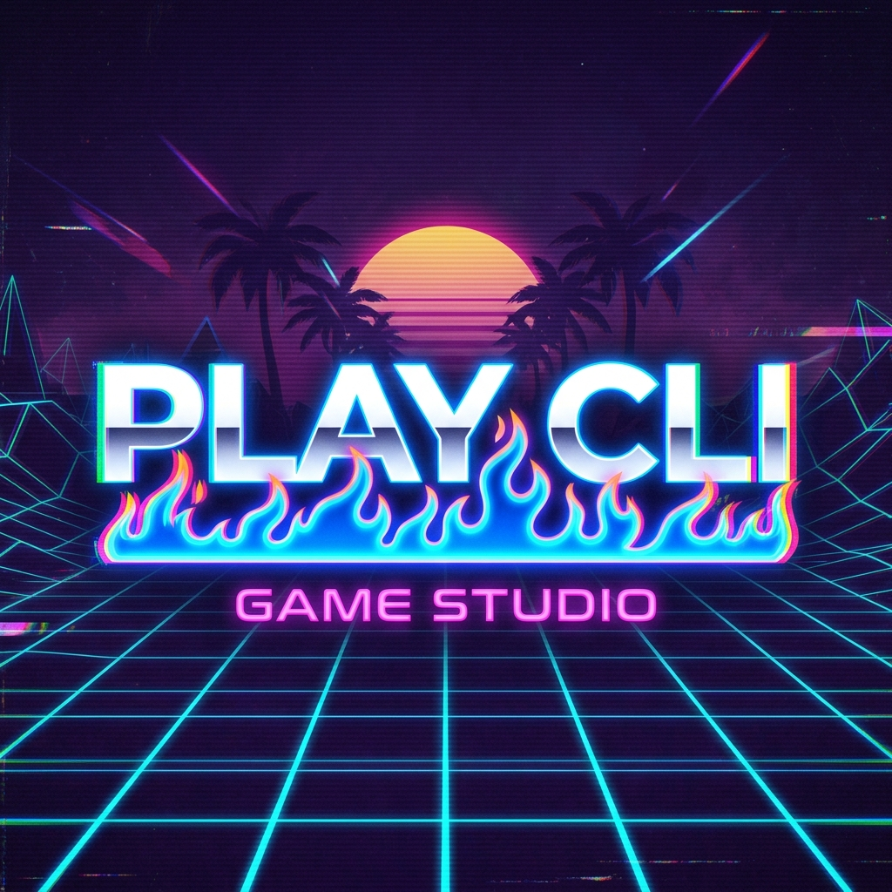

<p align="center">
  
</p>

# 🌴 PLAY CLI: The Underground Revolution You Can't Afford to Miss

**Stop building for yesterday's platforms.** 

While the rest of the world is drowning in bloated runtimes, heavy C-compilers, and fragmented dependencies, a select few are reclaiming the ultimate territory: **The Terminal.**

PLAY CLI isn't just a game launcher. It's a statement. It's the **Steam for the CLI**, built on the holy grail of technology—**WebAssembly (WASM) via WASI**.

---

## ⚡ Why the Elite are Moving to PLAY CLI

### 🛡️ 1. Absolute Authority: The WASM Fortress
We use `wazero`—the industry-leading, zero-dependency Go runtime. Your games run in a **strict security sandbox**. No file system access. No network leaks. Just pure, unadulterated performance. If it's not WASM, it's a security risk.

### 💎 2. Scarcity: First-Mover Advantage
The `registry.json` is currently curated. The first 100 developers to merge their games will receive **"Legacy Founder"** status in the ecosystem. As the platform scales, these slots will become the most coveted digital real estate in the CLI world. **Don't wait until the feed is saturated.**

### 🌐 3. CLI-Agnostic Mastery
Mac, Windows, Linux. It doesn't matter. One single binary to rule them all. If your users have a terminal, they have your game. **Cross-platform compatibility isn't a feature; it's a right.**

---

## 🚀 The Movement is Already Starting
Don't be the one reading about this on Hacker News three months from now. The underground revolution in CLI gaming is being built *right here*, *right now*.

### How to Join the Inner Circle

1. **Clone the Future:**
   ```bash
   git clone https://github.com/ostenjap/PLAYCLI.git
   ```

2. **Deploy the Launcher:**
   ```bash
   cd launcher
   go build -o playcli
   ```

3. **Experience the Magic:**
   ```bash
   ./playcli list
   ./playcli play guess
   ```

---

## 🛠️ For the Creators (Indie Hackers Only)
We’ve made it dangerously easy. Write in Rust, Go, Zig, or C. Compile to `wasip1`. Merge a PR. **Get played.**

> [!IMPORTANT]
> **Scarcity Alert:** The "Featured Indie" slots on the main list are filling up. Submit your `manifest.json` today to ensure your game is seen by the first wave of early adopters.

---

<p align="center">
  <b>Built for the vibe coders. Secured by the future.</b><br>
  <i>Join the 0.1% who spend their time where it matters.</i>
</p>
